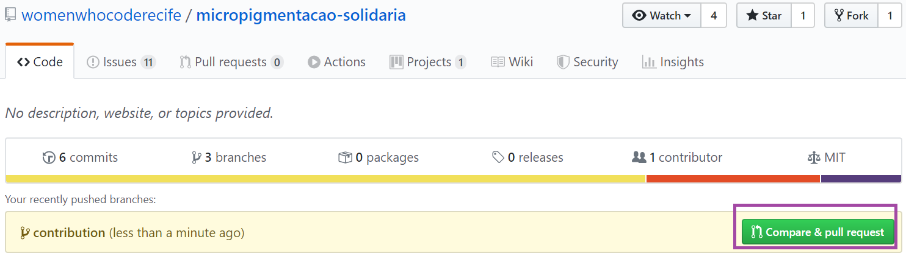
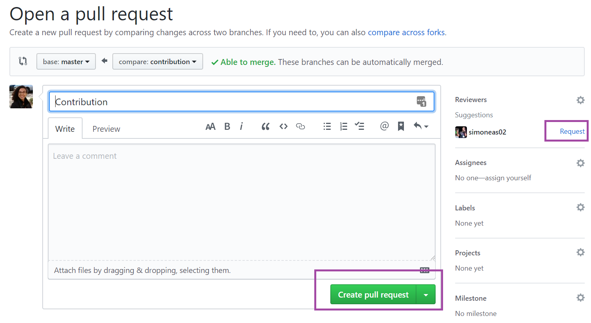

# Contributing

We adopeted English like official language to commits.

If you want to contribute with this project, follow this steps:

**1 -** Make sure that you're on project folder running the command bvellow on terminal:
```sh
$ pwd
```

**2 -** [Run the project local](./README.md)

**3 -** Create a new branch using the same name as the card
```sh
$ git checkout -b name-of-new-branch
```

**4 -** Work in the card and **remember** that is a good practices you make a commit immediately after a little modification

**5 -** Add the modified and new files in staging area:
```sh
$ git add name-file1 name-file2
```

**6 -** Make a commit:
```sh
$ git commit -m "write a short and significant sentence"
```

**7 -** Update master branch of the local repository before send your contribution:
```sh
$ git checkout master
$ git pull -r
```

**8 -** Update your branch with the new commits from online repository:
```sh
$ git checkout name-of-new-branch
$ git rebase master
```

**9 -** Send your contribution to online repository. Do this every day you work:

```sh
$ git push origin name-of-new-branch
```

**10 -** Go to [online repository](https://github.com/womenwhocoderecife/micropigmentacao-solidaria) and click on button `Compare and pull request`



**11 -** Make the pull request and let the reviewer know (click on the highlighted buttons)


